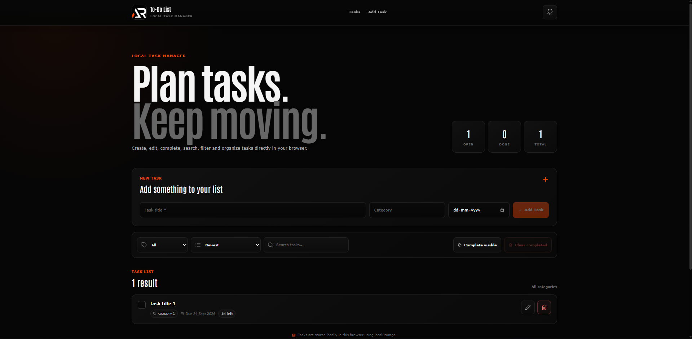

# To-Do List CRUD

A responsive task manager built with React and Vite. Tasks are stored locally in the browser and can be created, edited, completed, searched, filtered, sorted, and deleted.



## Features

- Create new tasks
- Edit existing tasks
- Delete tasks with confirmation
- Mark tasks complete or incomplete
- Categories
- Due dates
- Overdue task indication
- Search by title or category
- Category filtering
- Due date sorting
- Complete visible tasks
- Clear completed tasks
- LocalStorage persistence
- Task statistics
- Responsive mobile layout
- Accessible confirmation dialog
- Keyboard support
- Fixed scroll-aware header
- Mobile navigation
- Back-to-top button

## Tech Stack

- React
- Vite
- JavaScript
- styled-components
- React Icons
- LocalStorage

## Project Structure

```text
todo-list-crud
├── public
│   ├── favicon.ico
│   ├── logo.png
│   └── preview.png
│
├── src
│   ├── components
│   │   ├── backToTop
│   │   ├── confirmModal
│   │   ├── footer
│   │   ├── header
│   │   └── todoListCrud
│   │
│   ├── App.jsx
│   ├── index.css
│   └── main.jsx
│
├── .gitignore
├── eslint.config.js
├── index.html
├── LICENSE
├── package.json
├── README.md
├── screenshot.png
└── vite.config.js
```

## Getting Started

Clone the repository:

```bash
git clone https://github.com/a2rp/todo-list-crud.git
cd todo-list-crud
```

Install dependencies:

```bash
npm install
```

Start the development server:

```bash
npm run dev
```

Run ESLint:

```bash
npm run lint
```

Create a production build:

```bash
npm run build
```

## Local Storage

Tasks are stored in the browser using LocalStorage.

The application does not require a backend or external database.

Clearing browser storage will also remove saved tasks.

## Deployment

The project is configured for GitHub Pages.

Deploy with:

```bash
npm run deploy
```

Live site:

https://a2rp.github.io/todo-list-crud/

## Future Prospects

- Task priority levels
- Additional sorting options
- Import and export
- Drag-and-drop ordering
- Optional cloud synchronization

## License

This project is licensed under the MIT License.

## Links

- Portfolio: https://www.ashishranjan.net
- GitHub: https://github.com/a2rp
- CodePen: https://codepen.io/ash1198
- LinkedIn: https://www.linkedin.com/in/aashishranjan
- Facebook: https://www.facebook.com/theash.ashish
- YouTube: https://www.youtube.com/channel/UCLHIBQeFQIxmRveVAjLvlbQ
- Email: mailto:ash.ranjan09@gmail.com

## Support

- Support: https://a2rp-donation-page.netlify.app/
- Buy Me a Coffee: https://buymeacoffee.com/a2rp
- Patreon: https://www.patreon.com/a2rp
